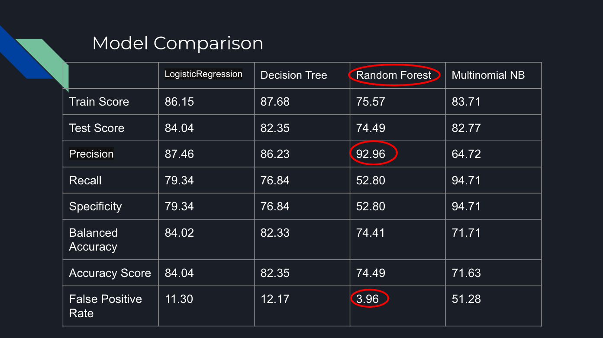

#  
# Project 3: Web APIs & NLP
Ramesh Babu | US-DSI-1130202

# Problem Statement
There are fine lines between `Ask - Philosophy` and `Change My View` . I took this as challange to find out weather Machine Learning Algortihm can be able to train to predit the differnce between the two by giving close to 20,000 converstations. I have picked `/r/askphilosophy` and  `/r/changemyview` from `https://www.reddit.com/r/ListOfSubreddits/wiki/listofsubreddits`

# Project Directory

```
3-Web-api-and-NL
├── README.md
├── code
│   ├── 01.ReadDataReddit.ipynb
│   ├── 02.EDA_and_Cleaning.ipynb
│   ├── 03.LogesticRegression.ipynb
│   ├── 04.DecisionTreeClassifier.ipynb
│   ├── 05.RandomForestClassifier.ipynb
│   └── 06.MultinomialNB.ipynb
├── data
│   ├── askphilosophy.csv
│   ├── changemyview.csv
│   └── changemyview_fixed.csv
├── images
│   └── project3.png
└── presentations
    └── 3-Web-api-and-NLP.pdf
```

# Data Collection & Cleaning Procedure
Data has been collected from `https://api.pushshift.io/reddit/search/submission`  with `subreddit` heading askphilosophy and changemyview. Since there are limitation about 100 posts per api call. so I need to make a loop of 100 and pull in 10,000 posts per subreddit. So I got about 20,000 rows for two calsification problem. 
Data Cleaning procedure started by looking into sample of titles and remove 
1. in changemyview subreddit , we need to remove `CMV' , 'cmv', 'Cmv' etc
2. Need to remove 26 duplicates rows 
3. Need to remove profane and cursing words


# Data modeling
1. Inital test of Logistic Regression gave a ROC-AUC of 98% this was too good to be true. So I have to go back to data and find out exclusive words like `CMV` and its variants .
2. On second trail I have built and tested , Logistic Regression, Decision Tree, Random Forset Tree, Multinomial NB

 


# Final Conclusions and Summary
   From the above comparison it is clear that , Random Forest Classification was the best model with Precision of 92.96 and False Positive Rate of 3.96.
   This shows that machine learning algorithm can be trained to predict the context of the topic . If we have more classification then we need more data to train the model.